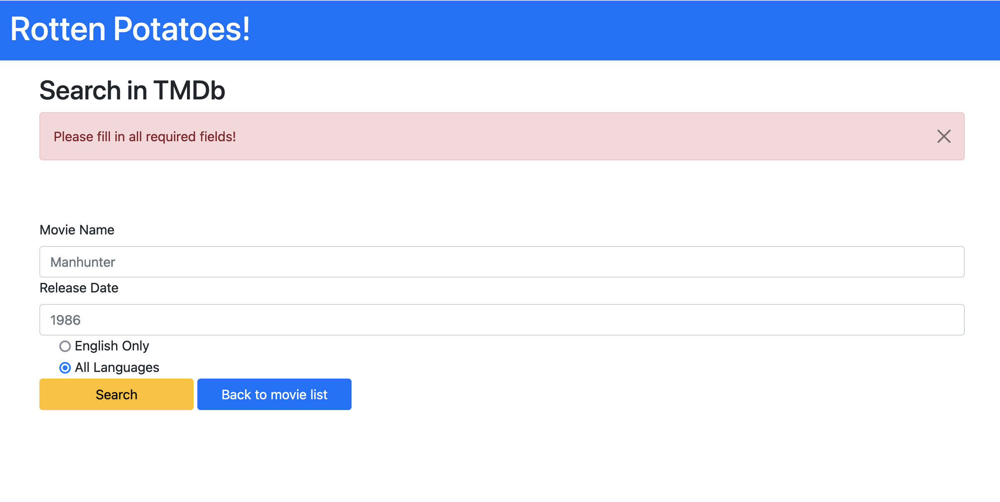
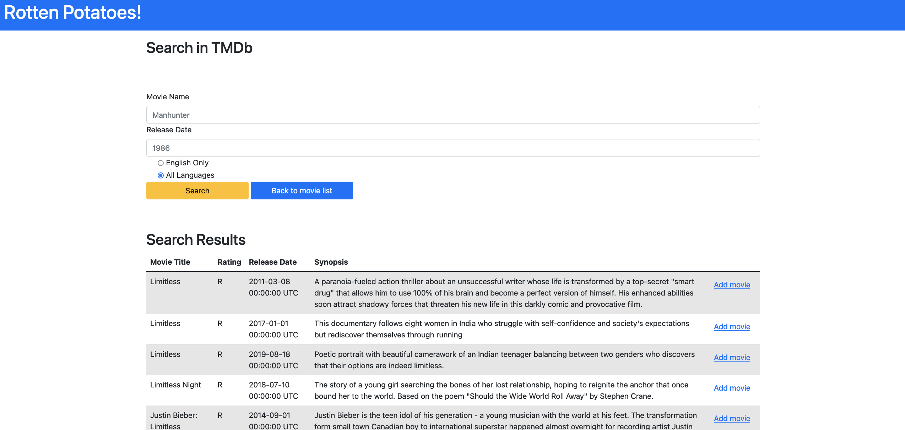
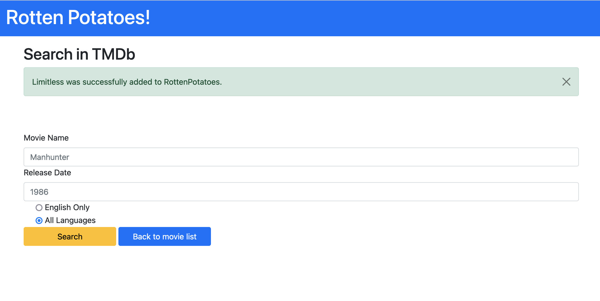

# Part 5 - Implementing `find_in_tmdb`, and Stubbing the Internet

## Storing API Keys Securely with Environment Variables

Hard-coding an API key directly into your source code is a serious security mistake. If you ever push your code to 
a public repo, GitHub will automatically detect exposed API keys and inform the provider. Storing plain API keys on a 
public domain will result in losing the API key. Even in a private repo, committing credentials is poor practice 
because it makes rotating keys painful and risks accidental exposure later.

The best approach is to store your API key as an environment variable: a named value that lives in the process's 
environment rather than in your code. Your Ruby code reads it at runtime, so the key itself never appears in your 
source files.

## Setting the variable locally with Docker

When you start your container with `docker run`, pass the key using the `-e` flag:

```bash
docker run -it -v "$(pwd):/app" -p 3000:3000 -e TMDB_API_KEY=your_key_here rspec
```

The key is now available inside the container as `ENV['TMDB_API_KEY']` for the lifetime of that container session. 
Notice it never touches any file in your project directory.

## Setting the variable through `.env`

If you get tired of typing the key every time, you can instead store it in a local `.env` file:

```bash
TMDB_API_KEY=your_key_here
```
And load it automatically with Docker's `--env-file` flag instead:

```bash
docker run -it -v "$(pwd):/app" -p 3000:3000 --env-file .env rspec
```

## Storing API keys

Storing API keys falls under the general category of credential management, and in past versions of `rails`, it has 
been done in a variety of ways. Since you only have one API key to store, we will forgo the process of securing your
credentials in an environment file, although this is a must for any real app you deploy. You can store your API key as
a parameter to the model method `find_in_tmdb` with some default value (possibly the correct API key). This will let 
you overwrite the API key with an invalid one when you are testing. 

If you push your code to GitHub, make sure the repo is set to a private mode (as it should be!) since GitHub will 
automatically detect exposed API keys and inform the provider. Storing plain API keys on a public domain will result 
in losing the API key. If you are not updating your GitHub repo as we go, you shall not worry about this, instead you 
will be deploying to Heroku directly.

## Setting the variable on Heroku

Heroku has a built-in way to store secrets called [config vars](https://devcenter.heroku.com/articles/config-vars). 
From your terminal:

```bash
heroku config:set TMDB_API_KEY=your_key_here
```

Heroku stores this securely and automatically injects it as an environment variable every time your app boots. You 
can verify it was set correctly:

```bash
heroku config:get TMDB_API_KEY
```

## Setting the variable on Render

If you're deploying on Render instead, the process is done through the dashboard rather than the CLI. Navigate to your 
service, click Environment in the left sidebar, then click + Add Environment Variable. Enter `TMDB_API_KEY` as the 
key and your API key as the value, then click Save, rebuild, and deploy. Render will securely store the value and make
it available as `ENV['TMDB_API_KEY']`. See 
[Render's environment variable docs](https://render.com/docs/configure-environment-variables) for more information.

## Implementing TMDb search

Equipped with an API key you will finally move on to implementing `find_in_tmdb` method. Recall that we only have 
three input fields, the `title` of the movie, the `release_year`, and the `language`. Note, that providing 
`release_year` is actually optional, so it can be left blank and the API call should still be performed, whereas 
if the `title` field is left out, the app should display an error message "Please fill in all required fields!". 
You may do this error checking in the controller method.



Additionally, if no matching movies are returned, the app should display "No movies found with given parameters!". 
As a starting point, copy the code below into the `search_tmdb.html.erb`; it will make sure that the messages are 
displayed in the desired style (well, almost, what should the value of key be? you might find Bootstrap 
[alerts](https://getbootstrap.com/docs/5.2/components/alerts/) and 
[colors](https://getbootstrap.com/docs/5.2/utilities/colors/) helpful).

```erb
<% flash.each do |key, value| %>
  <div class="alert alert-<%= key %> alert-dismissible fade show" role="alert">
    <%= value %>
    <button type="button" class="btn-close" data-bs-dismiss="alert" aria-label="Close"></button>
  </div>
<% end %>
```
The `find_in_tmdb` method should return a list of movies that have NOT been saved to the database. A slight nuance 
with TMDb API is that it actually does not return an MPAA rating on a query for movie lookups. This would need to be 
done in a separate API call, so we will not require displaying the correct ratings, and you should just put "R" for 
all of them (to be safe). Curious readers are encouraged to try fetching the correct ratings, but this will not be 
tested in the autograder (you may need to look up how ratings are stored as numbers in TMDb). 

## Stubbing API calls

Back to spec! Unfortunately, the spec we have written so far will actually call the real TMDb service every time it 
is executed, making the spec neither **F**ast (each call takes a few seconds to complete) nor **R**epeatable (the 
test will behave differently if TMDb is down or your computer is not connected to the Internet). Even if you only ran
tests while connected to the Internet, it is very bad etiquette to have your tests constantly contacting a production
service.

We can fix this by introducing a seam that isolates the caller from the callee. Once again we stand on the shoulders
of others. `WebMock` is stubbing library which we will use to stub our requests to the TMDb. Include the following
line in the `test` group of Gemfile and run `bundle install`.

```ruby
  gem "webmock"
```
Then, we will need to include this library in `spec/spec_helper.rb`. Add the code below to the top of that file.

```ruby
require 'webmock/rspec'
WebMock.disable_net_connect!(allow_localhost: true)
```
The first line requires the installed gem, and the second line disables any web requests. After you have done this,
make sure to include `spec_helper.rb` in the movie spec by calling `require 'spec_helper'`. What happens when we
run the model tests now? You may need to update the one test we included earlier; although we are expecting Faraday to be
called, the exact parameter is not important for this initial test (which is just making sure that Faraday is
receiving _some_ call). Update the `find_in_tmdb` call so that its argument resembles a more realistic argument, then
remove the `.with` call (since it's not as obvious anymore exactly what URL Faraday will be called with).

Let's be more explicit now. Add a new test which directly calls `Movie.find_in_tmdb`.

```ruby
it 'calls TMDb with valid API key' do
  Movie.find_in_tmdb({title: "hacker", language: "en"})
end
```
What happens when you run the spec now? You should get an error message approximately equivalent to something like 
`WebMock::NetConnectNotAllowedError:
      Real HTTP connections are disabled`. Yay, we are successfully blocking real HTTP requests in the spec, but how do we actually get data from the TMDb now? We don't, that is the entire point of stubbing an external call. Instead we will use a predefined response body which will be accessible for all tests in the movie spec. In `spec_helper.rb` go ahead and add the following block.

```ruby
RSpec.configure do |config|
  json_return = {"page":1,"results":[{"adult":false,"backdrop_path":"/kqMV9VUrGv9BbmRTOzXKyIraeOG.jpg","genre_ids":[],"id":716088,"original_language":"en","original_title":"Sydney 2000 Olympics Opening Ceremony","overview":"Coverage of the glorious Olympic Opening Ceremony of the Games in Sydney. The opening ceremony of the 2000 Summer Olympic games took place on Friday 15 September in Stadium Australia. As mandated by the Olympic Charter, the proceedings combined the formal and ceremonial opening of this international sporting event, including welcoming speeches, hoisting of the flags and the parade of athletes, with an artistic spectacle to showcase the host nation's culture and history.","popularity":3.733,"poster_path":"/nE9GGznpsYPuRIg3kCBgsfCwC2j.jpg","release_date":"2000-09-15","title":"Sydney 2000 Olympics Opening Ceremony","video":false,"vote_average":7.3,"vote_count":3},{"adult":false,"backdrop_path":"/7MMlToGu6JBVtL7myvNQIq0qtIf.jpg","genre_ids":[],"id":716098,"original_language":"en","original_title":"Sydney 2000 Olympics Closing Ceremony","overview":"The 2000 Summer Olympics Closing Ceremony took place on 1 October 2000 in Stadium Australia. The Closing Ceremony attracted 114,714 people, the largest attendance in modern Olympic Games history. IOC President Juan Antonio Samaranch declared that the 2000 Olympic games were best Olympic Games ever.","popularity":1.308,"poster_path":"/jSxterIFJPP5CDZ4Jderik25hxT.jpg","release_date":"2000-10-01","title":"Sydney 2000 Olympics Closing Ceremony","video":false,"vote_average":10,"vote_count":1}],"total_pages":1,"total_results":2}

  config.before(:each) do
    stub_request(:get, /api.themoviedb.org/).
      with(headers: {'Accept'=>'*/*'}).
      to_return(status: 200, body: JSON.generate(json_return), headers: {})
  end
end
```
Now, all tests should be green, because we have successfully stubbed the web with a fake response. The response we 
provide is actually the response of querying "Olympics" with a release year set to "2000". Surprisingly, only two 
entries showed up when queried with TMDb. 

OK, what's next? There are a number of things that we haven't tested yet. For example how would you check if the API 
key is valid, or how would you handle the case if there are no matching movies? One possible choice would be to stub 
these types of requests as well, just the way we did in `spec_helper.rb` for a generic response!
  
## Adding search results to the view

As a final step we need to display all the returned movies in a table, much like we did in the home page in prior 
CHIPS. Following a similar schematic as in the `index.html.erb` view, create a table where all the query results 
will go. The table you create should have an id set to `search_movies`. **Note**: When do we actually want to 
display this table? Should the table still be displayed if an error occurs?




Additionally, we want to have a button for each entry of the resulting movies so that the user can add these movies 
to their RottenPotatoes database. Since this button will modify the internal database, what type of an HTTP request 
should it resemble?

Recall that the view interacts with controller through forms, you will need to include a form for the last column of 
the table. The form should contain all the fields necessary to make a movie (i.e. `title`, `release_date`, etc.). 

> [!TIP]
> To add input elements without displaying them on the view, consider using `hidden_field_tag`. 

Since this _Add movie_ button makes a POST request, you will need to create a route and a controller action for 
it. Name these `add_movie`, and make sure to write tests as we did with `search_tmdb`, it will pay off later on!

In the controller method, save the movie object with the specified parameters to the database, and after, redirect to 
`/search` with the message "_movie_name_ was successfully added to RottenPotatoes."



Navigate back to the home page and make sure the movie added appears in the list of displayed movies. 

<details>
<summary>
  Would the newly added movie still be displayed if we left <code>rating</code> field empty when creating these movie 
  objects for the first time in <code>Movie.find_in_tmdb</code>?
</summary>
<blockquote>
  No, since we filter out movies in the <code>index</code> method of the controller. Movies with no matching ratings 
  will not be rendered from the SQL query.
</blockquote>
</details>
<br>
And voila, RottenPotatoes can now call TMDb API and dynamically add movies to the database.

## Your turn to test

So far we walked through writing RSpec tests together, but eventually you will have to start writing your own. 
Testing is essential part of Agile, and following patterns like Red-Green-Refactor will only benefit you in the 
long run. In the next part you will deploy the new version of RottenPotatoes to Heroku and then submit to autograder.
Unlike previous CHIPS, we will only expose a subset of the tests that you fail. To get full points you will 
_most likely_ need to write your own tests.

## Next
[Submission Instructions](Submission-Instructions.md)